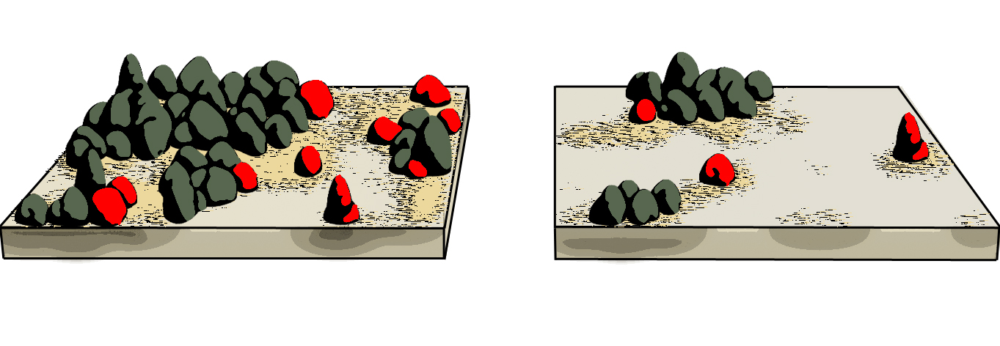

# Spatially explicit grazing and vegetation structure

## project outline

Spatial models of vegetation cover so far have considered grazing mortality a rather constant pressure, affecting all plants equally, regardless of their position in space. In the known models it usually adds as a constant to the individual plant risk (Kéfi et al 2007 TPB). However, grazing has a strong spatial component: Many plants in rangelands invest in protective structures such as thorns or spines, or develop growth forms that reduce their vulnerability to grazing.
Therefore, plants growing next to each other benefit from the protection of their neighbors.

Such **associational resistance** is widely acknowledged in vegetation ecology but hardly integrated in models as a cause for spatially heterogenous grazing pressure. It also renders the plant mortality density dependent, which has important impacts on the bistability of the system.

We investigate how the assumption of spatially heterogeneous pressure alters the bistability properties and the response of spatial indicators of catastrophic shifts.

<figcaption style = "font-size: 90%; padding: 0 40px"> Distribution of plants dying due to grazing (red) at high vegetation cover (left) and low cover (right). Traditional models assume equal risk for all plants.  </figcaption>

<figcaption style = "font-size: 90%; padding: 0 40px"> Our models assumes that plants that grow associated protect each other from grazing, whereas plants growing isolated suffer most. </figcaption>

### Main Questions & Answers

##### How does grazing pressure affect the resilience of drylands?
We found that resilience of ecosystem declines with grazing pressure.

##### How do spatial metrics of vegetation cover (candidate indicators of degradation) respond to increasing grazing pressure and environmental pressure?

Spatial indicators are quantitatively and qualitatively affected by spatially explicit grazing. Under high grazing pressure, no truncated cumulative patch-size distributions precede the collapse. The degradation happens to ecosystems with perfectly straight power-law distributions.

##### The emergence of vegetation patches: how does spatially-explicit grazing pressure interfere with spatially-explicit facilitation?

The individual level mechanisms, such as spatially-explicit grazing pressure and local facilitation, interact indirectly to define the patch level "life-cycle". The total plant mortality becomes a highly dynamic function of vegetation cover: At high cover, the pressure approximates zero, due to the almost full protection against grazing that plants provide each other.
At low cover, the mostly isolated plants suffer from grazing and will likely be lost as well.

## project details
### responsability:
Florian Schneider and Sonia Kéfi (CNRS / University of Montpellier 2)

### status:
Simulations and Analyses are done. Manuscript is in preparation and about to be submitted in September 2014.

### presentations, publications and outreach:
- Talk on CASCADE project meeting (March 2014 in Paphos, Cyprus) by Florian Schneider
- NETLOGO implementations of the model on GitHub (open source)
