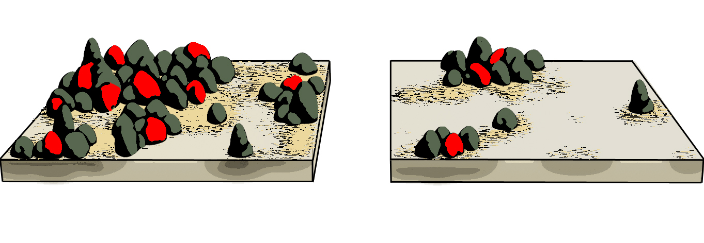

# Spatially explicit grazing and vegetation structure

## project outline

Spatial models of vegetation cover so far have considered grazing mortality a rather constant pressure, affecting all plants equally, regardless of their position in space. In the known models it usually adds as a constant to the individual plant risk (Kéfi et al 2007 TPB). However, grazing has a strong spatial component: Many plants in rangelands invest in protective structures such as thorns or spines, or develop growth forms that reduce their vulnerability to grazing.
Therefore, plants growing next to each other benefit from the protection of their neighbors.

Such **associational resistance** is widely acknowledged in vegetation ecology but hardly integrated in models as a cause for spatially heterogenous grazing pressure. It also renders the plant mortality density dependent, which has important impacts on the bistability of the system.

We investigate how the assumption of spatially heterogeneous pressure alters the bistability properties and the response of spatial indicators of catastrophic shifts.

<figcaption style = "font-size: 90%; padding: 0 40px">  </figcaption>

## project details
### responsability:
Florian Schneider and Sonia Kéfi (CNRS / University of Montpellier 2)

### status:
Simulations and Analyses are done. Manuscript is in preparation and about to be submitted in September 2014.

### presentations, publications and outreach:
- Talk on CASCADE project meeting (March 2014 in Paphos, Cyprus) by Florian Schneider
- NETLOGO implementations of the model on GitHub (open source)
